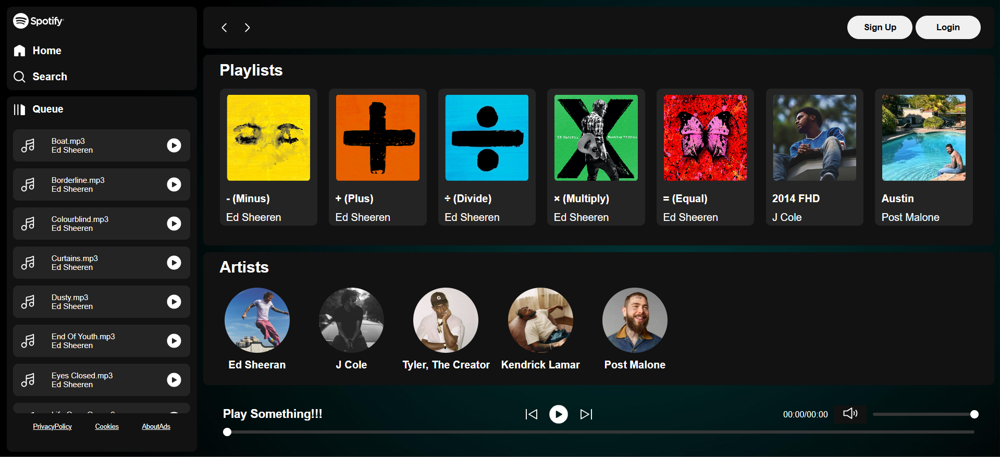

<div>
  
</div>

<br>

A beautiful and responsive Spotify-inspired music player built with **HTML**, **CSS**, and **JavaScript**. It features custom playlists, artist profiles, interactive playback controls, and a sleek UI—all with local audio and album data.

<br>

<div align="center">
  
</div>

## 📁 Project Structure

```bash
📁 project-root/
├── index.html # Main entry point
├── favicon.ico # Favicon
├── style/ # CSS styles
│ ├── style.css
│ └── utility.css
├── script/
│ └── script.js # Core interactivity
├── img/ # UI assets (icons, backgrounds)
├── artistImg/ # Artist images
├── playlistImg/ # Album cover images
└── songs/ # Local song & metadata folders
```

## 🎯 Features

- ✅ Responsive modern UI
- ✅ Custom albums with info from `info.json`
- ✅ Interactive audio playback (Play, Pause, Next, Previous)
- ✅ Volume and seek controls
- ✅ Artist & playlist-based organization
- ✅ Smooth transitions and hover effects

## 🛠️ How to Run

1. **Clone this repository**  
```bash
   git clone https://github.com/your-username/spotify-clone.git
   cd spotify-clone
```

2. **Launch the app**  
```bash
   git clone https://github.com/your-username/spotify-clone.git
   cd spotify-clone
```

